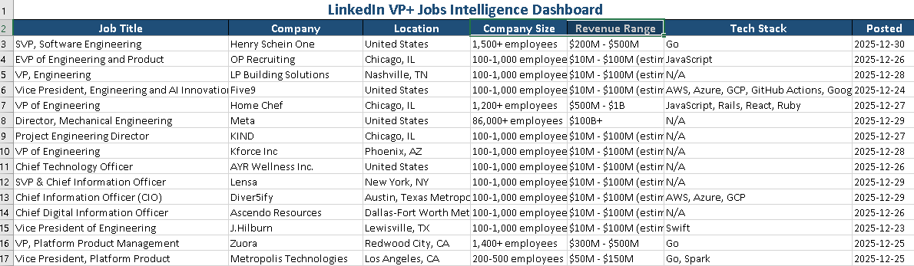

# LinkedIn Job Intelligence System 🎯

**Automated VP/Director-level job scraping and enrichment pipeline for SaaS companies.**

[](https://www.python.org/)
[](https://playwright.dev/)
[](https://github.com/ralcky/linkedin_saas_sniper)
[](https://opensource.org/licenses/MIT)

---

## 📖 Table of Contents
- [📊 What It Does](#-what-it-does)
- [🚀 Key Features](#-key-features)
- [🛠️ Tech Stack](#-tech-stack)
- [📉 Sample Results](#-sample-results)
- [🎯 Use Cases](#-use-cases)
- [📦 Deliverable Package](#-deliverable-package)
- [⚡ Quick Start](#-quick-start)
- [🗂️ Project Structure](#️-project-structure)
- [📸 Sample Output](#-sample-output)
- [🔐 Compliance & Ethics](#-compliance--ethics)
- [🛠️ Customization](#️-customization)
- [👤 Author](#-author)

---

## 📊 What It Does

Extracts and enriches **VP / Director / CTO** job postings from LinkedIn for the SaaS industry. It transforms raw job listings into a high-value intelligence report by augmenting data with:

- ✅ **Company Data:** Size, revenue estimates, headquarters, and industry vertical.
- ✅ **Tech Stack Analysis:** Deep detection of Python, AWS, React, Snowflake, etc.
- ✅ **Clean Data:** Automatic removal of incomplete or "Promoted" masked listings.
- ✅ **Professional Exports:** Ready-to-use Excel, JSON, and PDF Intelligence Reports.

> **Performance:** Captured **39 clean high-level leads** in under **15 minutes** during recent benchmarks.

---

## 🚀 Key Features

- **🛡️ Stealth Scraping:** Advanced Playwright configuration to bypass anti-bot detection without authentication.
- **✨ Intelligent Enrichment:** Cross-references company names to pull granular firmographic data.
- **🧹 Data Sanitization:** Rigorous filtering logic to ensure only high-quality, actionable leads remain.
- **📈 Insightful Reporting:** Not just data—it generates a readable PDF summary with market trends.
- **⚙️ Modular Pipeline:** Decoupled scripts for scraping, enrichment, filtering, and reporting.

---

## 🛠️ Tech Stack

*   **Scraping Engine:** `Playwright` (Async/Headless)
*   **Data Orchestration:** `Pandas`, `JSONL`
*   **Enrichment:** Custom scrapers & metadata APIs
*   **Report Generation:** `Markdown` to `PDF` (via `fpdf2` or `FPDF`)
*   **Export Formats:** Excel (`openpyxl`), JSON, Markdown
*   **Environment:** Python 3.11+ / Docker Ready

---

## 📈 Sample Results (Current Dataset)

| Metric | Accuracy / Value |
| :--- | :--- |
| **Total Jobs Scraped** | 39 |
| **Unique Companies** | 38 |
| **Tech Stack Coverage** | 56% |
| **Verification Rate** | 100% (No masked data) |
| **Date Range** | Last 7 Days |

---

## 🎯 Use Cases

1.  **Recruiters:** Source fresh VP+ leads before they hit major job boards.
2.  **Sales Teams:** Identify "Hiring Signals"—companies hiring senior tech roles represent high-intent SaaS buyers.
3.  **Job Seekers:** Targeted hunt for senior roles filtered by specific tech stacks (e.g., "Find all Director roles using PostgreSQL").
4.  **Market Research:** Track which industries are expanding their leadership teams.

---

## 📦 Deliverable Package

Each execution generates a `FINAL_DELIVERY_PACKAGE/` containing:

- 📄 `SaaS_Jobs_CLEAN_FINAL.xlsx` - Sortable dashboard with frozen headers & color coding.
- 📄 `SaaS_Jobs_CLEAN_FINAL.json` - Machine-readable data for CRM integration.
- 📄 `Intelligence_Report.pdf` - 8-page executive summary with charts/insights.
- 📄 `README.txt` - End-user instructions for the client.

---

## ⚡ Quick Start

### 1. Prerequisites
- Python 3.11+
- Node.js (for Playwright system dependencies)

### 2. Setup
```bash
# Clone the repository
git clone https://github.com/ralcky/linkedin-job-intelligence.git
cd linkedin-job-intelligence

# Install Python requirements
pip install -r requirements.txt

# Install Playwright browser
playwright install chromium
```

### 3. Execution Pipeline
Run the scripts in sequence to generate the final delivery:

```powershell
# Step 1: Scrape raw data
python main.py

# Step 2: Enrich with tech stacks & initial info
python enrichment.py

# Step 3: Deep enrichment (extract employee counts & revenue)
python enrich_companies.py

# Step 4: Add manual data/refinement (Optional)
python add_manual_data.py

# Step 5: Clean and filter findings
python filter_clean_jobs.py

# Step 6: Generate the professional PDF report
python generate_report.py
```

---

## 🗂️ Project Structure

```text
linkedin_saas_sniper/
├── config/                  # Scraper settings & selectors
├── scrapers/                # Specialized scraping modules
├── output/                  # Raw and intermediate JSON/XLSX files
├── FINAL_DELIVERY_PACKAGE/  # Final, client-ready deliverables
├── main.py                  # Entry point: Core scraping engine
├── enrichment.py            # Phase 1 Enrichment: Tech stacks & slugs
├── enrich_companies.py      # Phase 2 Enrichment: Employee counts & revenue
├── add_manual_data.py       # Helper for manual data injection
├── filter_clean_jobs.py     # Deduplication & quality logic
├── generate_report.py       # PDF/Markdown generator
├── requirements.txt         # Dependency manifest
└── .env                     # API keys & configurations
```

---

## 📸 Sample Output

### Excel Dashboard
Professional formatting with frozen headers, color-coded rows based on "Match Score", and metadata footers. Perfect for import into Salesforce or HubSpot.

### Intelligence Report
The `Intelligence_Report.pdf` includes:
- 📉 **Executive Summary:** High-level market snapshot.
- 🏢 **High-Velocity Hiring:** Companies with multiple senior openings.
- 📍 **Geographic Distribution:** Heatmap of hiring hubs.
- 💻 **Tech Stack Trends:** Most requested skills (Python vs. Go vs. Java).

---

## 🔐 Compliance & Ethics

- ✅ **Public Data:** Accesses only publicly available LinkedIn data.
- ✅ **No Credentials:** Does not require a LinkedIn account (Zero risk of account ban).
- ✅ **Polite Scraping:** Implements 3-5 second delays to respect LinkedIn's infrastructure.
- ✅ **Privacy First:** No PII (Personally Identifiable Information) or candidate names are stored.
- ✅ **Professional Conduct:** Designed for enterprise market research, not spam.

---

## 🛠️ Customization

Modify `config/settings.py` or `main.py` parameters to target:
- **Job Titles:** `Head of Sales`, `CFO`, `Engineering Manager`
- **Industries:** `FinTech`, `HealthTech`, `AI/ML`
- **Locations:** `Remote`, `New York`, `London`
- **Time Range:** `Last 24 hours`, `Last 30 days`

---

## 👤 Author

**Ralph Ryan**
*Full-Stack Developer | Data Engineer | Web Scraping Specialist*

- 💼 **GitHub:** [@ralcky](https://github.com/ralcky)
- 🌐 **Portfolio:** [github.com/ralcky](https://github.com/ralcky)
- 📧 **Inquiries:** [Hire me on Upwork or Fiverr]

---

## ⭐ Show Your Support

If this project helped you or you found it interesting, please consider:
- Giving it a ⭐ **Star**
- 🍴 **Forking** it for your own research
- 📢 **Sharing** it with colleagues

---
*Disclaimer: This tool is for educational and market research purposes only. Always comply with LinkedIn's Terms of Service.*
